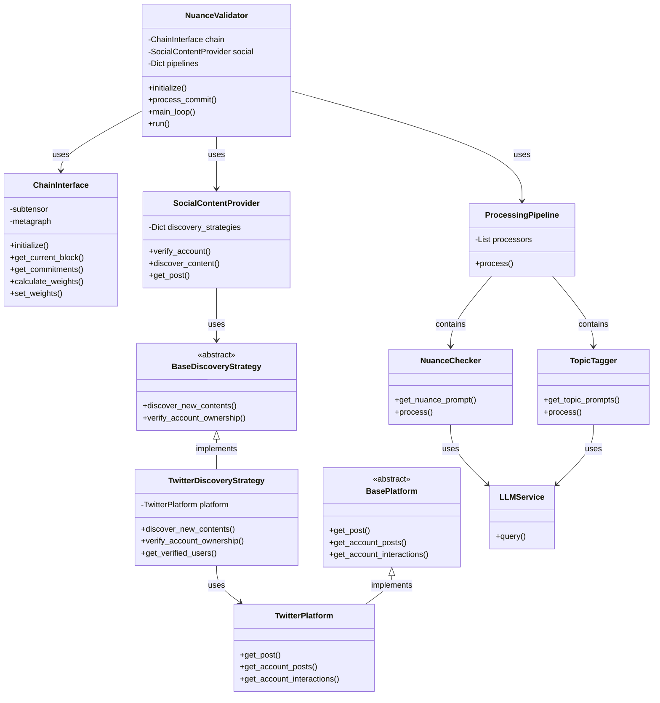

```mermaid
classDiagram
    class NuanceValidator {
        -ChainInterface chain
        -SocialContentProvider social
        -Dict pipelines
        +initialize()
        +process_commit()
        +main_loop()
        +run()
    }
    
    class ChainInterface {
        -subtensor
        -metagraph
        +initialize()
        +get_current_block()
        +get_commitments()
        +calculate_weights()
        +set_weights()
    }
    
    class SocialContentProvider {
        -Dict discovery_strategies
        +verify_account()
        +discover_content()
        +get_post()
    }
    
    class BaseDiscoveryStrategy {
        <<abstract>>
        +discover_new_contents()
        +verify_account_ownership()
    }
    
    class TwitterDiscoveryStrategy {
        -TwitterPlatform platform
        +discover_new_contents()
        +verify_account_ownership()
        +get_verified_users()
    }
    
    class BasePlatform {
        <<abstract>>
        +get_post()
        +get_account_posts()
        +get_account_interactions()
    }
    
    class TwitterPlatform {
        +get_post()
        +get_account_posts()
        +get_account_interactions()
    }
    
    class ProcessingPipeline {
        -List processors
        +process()
    }
    
    class NuanceChecker {
        +get_nuance_prompt()
        +process()
    }
    
    class TopicTagger {
        +get_topic_prompts()
        +process()
    }
    
    class LLMService {
        +query()
    }
    
    NuanceValidator --> ChainInterface : uses
    NuanceValidator --> SocialContentProvider : uses
    NuanceValidator --> ProcessingPipeline : uses
    
    SocialContentProvider --> BaseDiscoveryStrategy : uses
    BaseDiscoveryStrategy <|-- TwitterDiscoveryStrategy : implements
    
    TwitterDiscoveryStrategy --> TwitterPlatform : uses
    BasePlatform <|-- TwitterPlatform : implements
    
    ProcessingPipeline --> NuanceChecker : contains
    ProcessingPipeline --> TopicTagger : contains
    
    NuanceChecker --> LLMService : uses
    TopicTagger --> LLMService : uses
```
