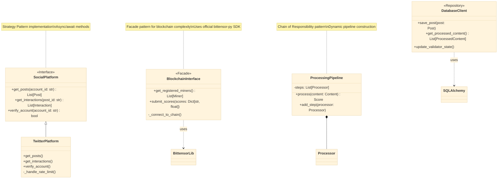

```mermaid
%%{init: {
  'theme': 'base',
  'themeVariables': {
    'fontSize': '20px',
    'nodeFontSize': '18px',
    'edgeLabelFontSize': '16px'
  },
  'viewBox': '0 0 2000 1500',
  'flowchart': { 'nodeSpacing': 200, 'rankSpacing': 60 }
}}%%

classDiagram
    class SocialPlatform {
        <<Interface>>
        +get_posts(account_id: str) List[Post]
        +get_interactions(post_id: str) List[Interaction]
        +verify_account(account_id: str) bool
    }

    class TwitterPlatform {
        +get_posts()
        +get_interactions()
        +verify_account()
        -_handle_rate_limit()
    }

    class ProcessingPipeline {
        +process(content: Content) Score
        -steps: List[Processor]
        +add_step(processor: Processor)
    }

    class BlockchainInterface {
        <<Facade>>
        +get_registered_miners() List[Miner]
        +submit_scores(scores: Dict[str, float])
        -_connect_to_chain()
    }

    class DatabaseClient {
        <<Repository>>
        +save_post(post: Post)
        +get_processed_content() List[ProcessedContent]
        +update_validator_state()
    }

    SocialPlatform <|-- TwitterPlatform
    ProcessingPipeline *-- Processor
    BlockchainInterface ..> BittensorLib : uses
    DatabaseClient ..> SQLAlchemy : uses

    note for SocialPlatform "Strategy Pattern implementation\nAsync/await methods"
    note for BlockchainInterface "Facade pattern for blockchain complexity\nUses official bittensor-py SDK"
    note for ProcessingPipeline "Chain of Responsibility pattern\nDynamic pipeline construction"
```
