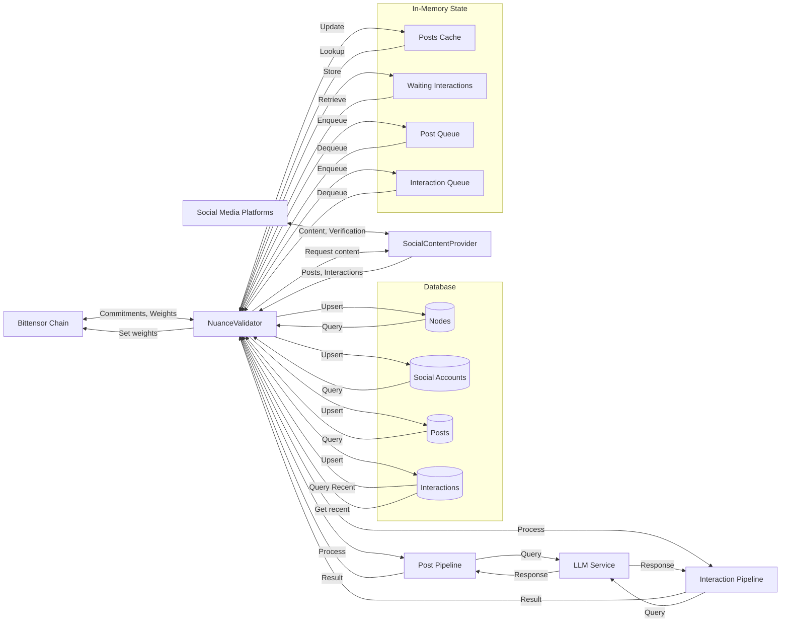

```mermaid
flowchart LR
    %% External systems
    bittensor["Bittensor Chain"]
    social["Social Media Platforms"]
    
    %% Core components
    validator["NuanceValidator"]
    social_provider["SocialContentProvider"]
    post_pipeline["Post Pipeline"]
    interaction_pipeline["Interaction Pipeline"]
    llm["LLM Service"]
    
    %% Data stores
    subgraph Database
        nodes[("Nodes")]
        accounts[("Social Accounts")]
        posts[("Posts")]
        interactions[("Interactions")]
    end
    
    subgraph "In-Memory State"
        post_cache["Posts Cache"]
        waiting_interactions["Waiting Interactions"]
        post_queue["Post Queue"]
        interaction_queue["Interaction Queue"]
    end
    
    %% External data flows
    bittensor <-- "Commitments, Weights" --> validator
    social <-- "Content, Verification" --> social_provider
    
    %% Discovery flows
    validator -- "Request content" --> social_provider
    social_provider -- "Posts, Interactions" --> validator
    
    %% Database flows
    validator -- "Upsert" --> nodes
    validator -- "Upsert" --> accounts
    nodes -- "Query" --> validator
    accounts -- "Query" --> validator
    
    %% Processing flows
    validator -- "Enqueue" --> post_queue
    validator -- "Enqueue" --> interaction_queue
    post_queue -- "Dequeue" --> validator
    interaction_queue -- "Dequeue" --> validator
    
    validator -- "Process" --> post_pipeline
    post_pipeline -- "Result" --> validator
    validator -- "Process" --> interaction_pipeline
    interaction_pipeline -- "Result" --> validator
    
    post_pipeline -- "Query" --> llm
    interaction_pipeline -- "Query" --> llm
    llm -- "Response" --> post_pipeline
    llm -- "Response" --> interaction_pipeline
    
    %% Storage flows
    validator -- "Update" --> post_cache
    post_cache -- "Lookup" --> validator
    validator -- "Store" --> waiting_interactions
    waiting_interactions -- "Retrieve" --> validator
    
    validator -- "Upsert" --> posts
    posts -- "Query" --> validator
    validator -- "Upsert" --> interactions
    interactions -- "Query Recent" --> validator
    
    %% Score aggregation flow
    interactions -- "Get recent" --> validator
    validator -- "Set weights" --> bittensor
```