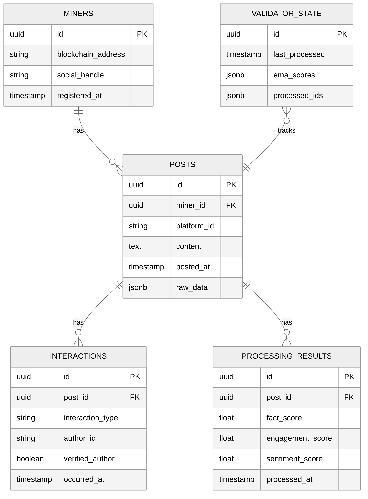

```mermaid
%%{init: {'theme': 'neutral'}}%%
erDiagram
    MINERS {
        uuid id PK
        string blockchain_address
        string social_handle
        timestamp registered_at
    }
    
    POSTS {
        uuid id PK
        uuid miner_id FK
        string platform_id
        text content
        timestamp posted_at
        jsonb raw_data
    }

    INTERACTIONS {
        uuid id PK
        uuid post_id FK
        string interaction_type
        string author_id
        boolean verified_author
        timestamp occurred_at
    }

    PROCESSING_RESULTS {
        uuid id PK
        uuid post_id FK
        float fact_score
        float engagement_score
        float sentiment_score
        timestamp processed_at
    }

    VALIDATOR_STATE {
        uuid id PK
        timestamp last_processed
        jsonb ema_scores
        jsonb processed_ids
    }

    MINERS ||--o{ POSTS : "has"
    POSTS ||--o{ INTERACTIONS : "has"
    POSTS ||--o{ PROCESSING_RESULTS : "has"
    VALIDATOR_STATE }o--|| POSTS : "tracks"
```
