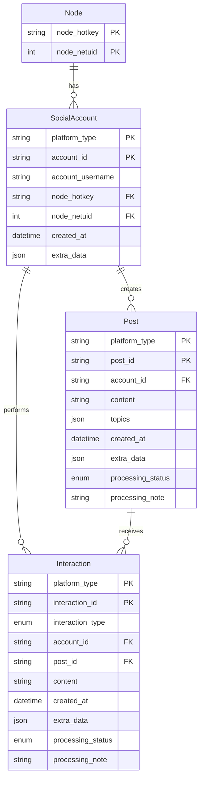

```mermaid
erDiagram
    Node ||--o{ SocialAccount : "has"
    SocialAccount ||--o{ Post : "creates"
    SocialAccount ||--o{ Interaction : "performs"
    Post ||--o{ Interaction : "receives"
    
    Node {
        string node_hotkey PK
        int node_netuid PK
    }
    
    SocialAccount {
        string platform_type PK
        string account_id PK
        string account_username
        string node_hotkey FK
        int node_netuid FK
        datetime created_at
        json extra_data
    }
    
    Post {
        string platform_type PK
        string post_id PK
        string account_id FK
        string content
        json topics
        datetime created_at
        json extra_data
        enum processing_status
        string processing_note
    }
    
    Interaction {
        string platform_type PK
        string interaction_id PK
        enum interaction_type
        string account_id FK
        string post_id FK
        string content
        datetime created_at
        json extra_data
        enum processing_status
        string processing_note
    }
```