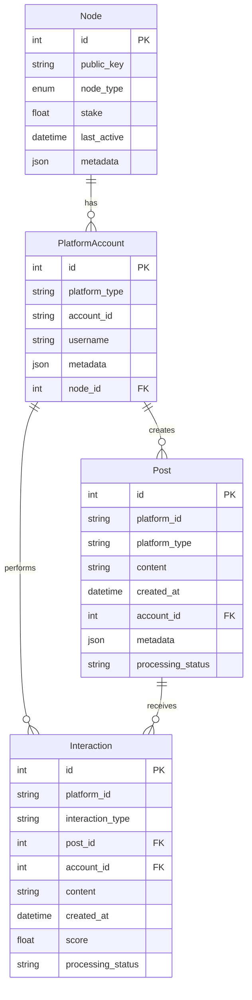

```mermaid
erDiagram
    Node ||--o{ PlatformAccount : "has"
    PlatformAccount ||--o{ Post : "creates"
    PlatformAccount ||--o{ Interaction : "performs"
    Post ||--o{ Interaction : "receives"
    
    Node {
        int id PK
        string public_key
        enum node_type
        float stake
        datetime last_active
        json metadata
    }
    
    PlatformAccount {
        int id PK
        string platform_type
        string account_id
        string username
        json metadata
        int node_id FK
    }
    
    Post {
        int id PK
        string platform_id
        string platform_type
        string content
        datetime created_at
        int account_id FK
        json metadata
        string processing_status
    }
    
    Interaction {
        int id PK
        string platform_id
        string interaction_type
        int post_id FK
        int account_id FK
        string content
        datetime created_at
        float score
        string processing_status
    }
```