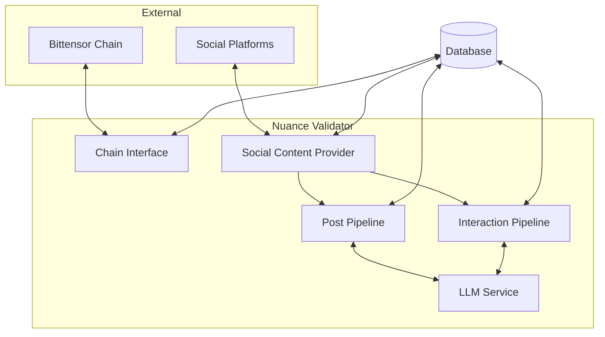

```mermaid
flowchart TB
    subgraph External
        BT[Bittensor Chain]
        SP[Social Platforms]
    end
    
    DB[(Database)]
    
    subgraph Validator["Nuance Validator"]
        CI[Chain Interface]
        SCP[Social Content Provider]
        PP[Post Pipeline]
        IP[Interaction Pipeline]
        LLM[LLM Service]
    end
    
    BT <--> CI
    SP <--> SCP
    SCP --> PP
    SCP --> IP
    PP <--> LLM
    IP <--> LLM
    
    DB <--> CI
    DB <--> SCP
    DB <--> PP
    DB <--> IP
```