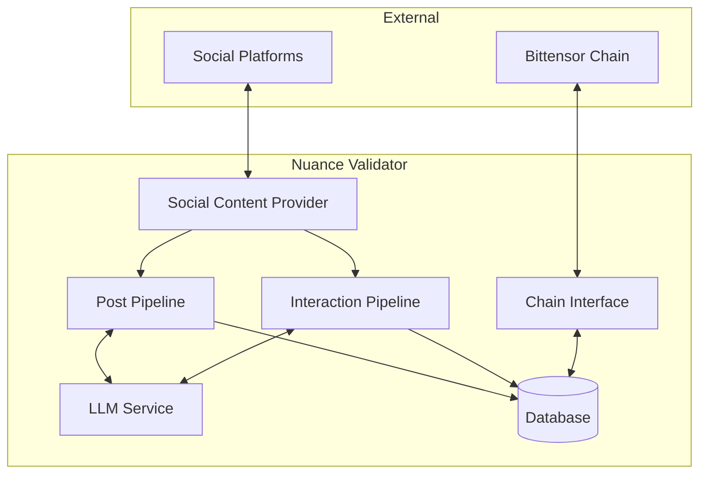

```mermaid
flowchart TB
    subgraph External
        BT[Bittensor Chain]
        SP[Social Platforms]
    end
    
    subgraph Validator["Nuance Validator"]
        CI[Chain Interface]
        SCP[Social Content Provider]
        PP[Post Pipeline]
        IP[Interaction Pipeline]
        LLM[LLM Service]
        DB[(Database)]
    end
    
    BT <--> CI
    SP <--> SCP
    SCP --> PP
    SCP --> IP
    PP <--> LLM
    IP <--> LLM
    PP --> DB
    IP --> DB
    CI <--> DB
```