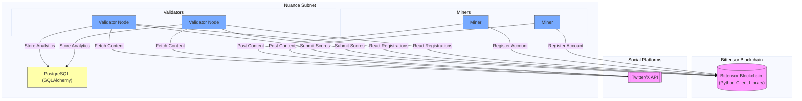

```mermaid
%%{init: {
  'theme': 'base',
  'themeVariables': {
    'fontSize': '20px',
    'nodeFontSize': '18px',
    'edgeLabelFontSize': '16px'
  },
  'viewBox': '0 0 2000 1500',
  'flowchart': { 'nodeSpacing': 200, 'rankSpacing': 60 }
}}%%

graph TD
    subgraph Bittensor Blockchain
        BT[("Bittensor Blockchain (Python Client Library)")]
    end
    
    subgraph Social Platforms
        TW[[Twitter/X API]]
    end

    subgraph Nuance Subnet
        DB["PostgreSQL (SQLAlchemy)"]
        
        subgraph Validators
            V1[Validator Node]
            V2[Validator Node]
        end

        subgraph Miners
            M1[Miner]
            M2[Miner]
        end
    end

    M1 -->|Post Content| TW
    M2 -->|Post Content| TW
    M1 -->|Register Account| BT
    M2 -->|Register Account| BT
    V1 -->|Read Registrations| BT
    V2 -->|Read Registrations| BT
    V1 -->|Fetch Content| TW
    V2 -->|Fetch Content| TW
    V1 -->|Store Analytics| DB
    V2 -->|Store Analytics| DB
    V1 -->|Submit Scores| BT
    V2 -->|Submit Scores| BT

    classDef external fill:#f9f,stroke:#333;
    classDef system fill:#7af,stroke:#333;
    classDef storage fill:#ffa,stroke:#333;
    class BT,TW external;
    class DB storage;
    class V1,V2,M1,M2 system;

```