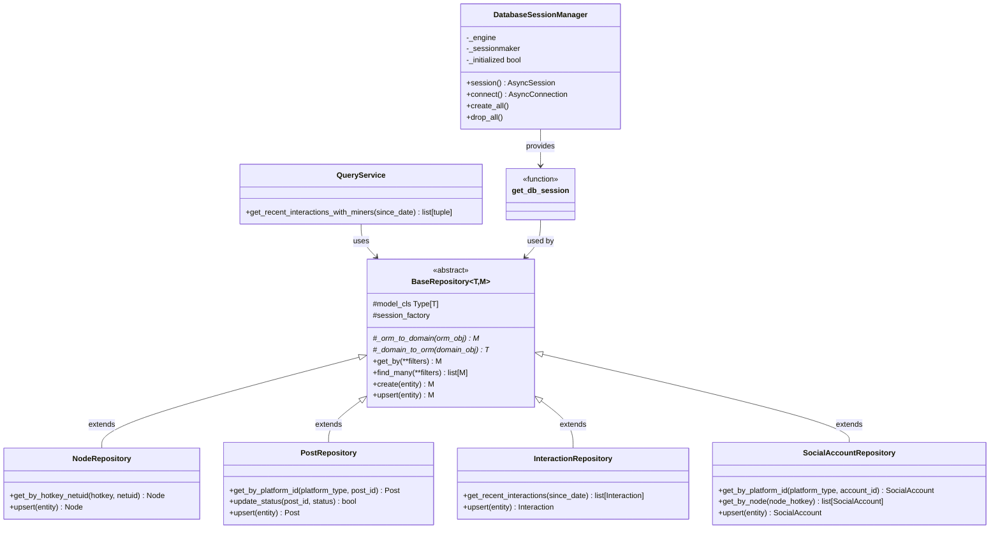

```mermaid
classDiagram
    class DatabaseSessionManager {
        -_engine
        -_sessionmaker
        -_initialized bool
        +session() AsyncSession
        +connect() AsyncConnection
        +create_all()
        +drop_all()
    }
    
    class BaseRepository~T,M~ {
        <<abstract>>
        #model_cls Type[T]
        #session_factory
        #_orm_to_domain(orm_obj)* M
        #_domain_to_orm(domain_obj)* T
        +get_by(**filters) M
        +find_many(**filters) list[M]
        +create(entity) M
        +upsert(entity) M
    }
    
    class NodeRepository {
        +get_by_hotkey_netuid(hotkey, netuid) Node
        +upsert(entity) Node
    }
    
    class PostRepository {
        +get_by_platform_id(platform_type, post_id) Post
        +update_status(post_id, status) bool
        +upsert(entity) Post
    }
    
    class InteractionRepository {
        +get_recent_interactions(since_date) list[Interaction]
        +upsert(entity) Interaction
    }
    
    class SocialAccountRepository {
        +get_by_platform_id(platform_type, account_id) SocialAccount
        +get_by_node(node_hotkey) list[SocialAccount]
        +upsert(entity) SocialAccount
    }
    
    class QueryService {
        +get_recent_interactions_with_miners(since_date) list[tuple]
    }
    
    class get_db_session {
        <<function>>
    }
    
    BaseRepository <|-- NodeRepository : extends
    BaseRepository <|-- PostRepository : extends
    BaseRepository <|-- InteractionRepository : extends
    BaseRepository <|-- SocialAccountRepository : extends
    
    QueryService --> BaseRepository : uses
    DatabaseSessionManager --> get_db_session : provides
    get_db_session --> BaseRepository : used by
```