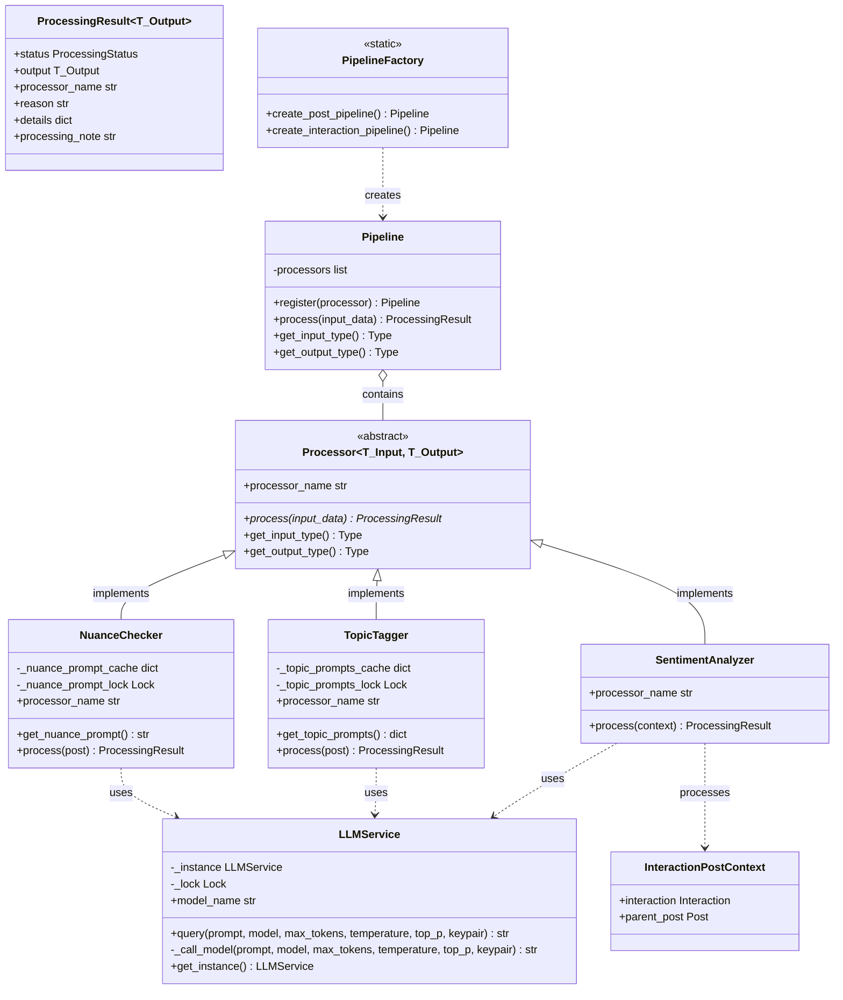

```mermaid
classDiagram
    class Processor~T_Input, T_Output~ {
        <<abstract>>
        +processor_name str
        +process(input_data)* ProcessingResult
        +get_input_type() Type
        +get_output_type() Type
    }
    
    class ProcessingResult~T_Output~ {
        +status ProcessingStatus
        +output T_Output
        +processor_name str
        +reason str
        +details dict
        +processing_note str
    }
    
    class Pipeline {
        -processors list
        +register(processor) Pipeline
        +process(input_data) ProcessingResult
        +get_input_type() Type
        +get_output_type() Type
    }
    
    class PipelineFactory {
        <<static>>
        +create_post_pipeline() Pipeline
        +create_interaction_pipeline() Pipeline
    }
    
    class NuanceChecker {
        -_nuance_prompt_cache dict
        -_nuance_prompt_lock Lock
        +processor_name str
        +get_nuance_prompt() str
        +process(post) ProcessingResult
    }
    
    class TopicTagger {
        -_topic_prompts_cache dict
        -_topic_prompts_lock Lock
        +processor_name str
        +get_topic_prompts() dict
        +process(post) ProcessingResult
    }
    
    class SentimentAnalyzer {
        +processor_name str
        +process(context) ProcessingResult
    }
    
    class LLMService {
        -_instance LLMService
        -_lock Lock
        +model_name str
        +query(prompt, model, max_tokens, temperature, top_p, keypair) str
        -_call_model(prompt, model, max_tokens, temperature, top_p, keypair) str
        +get_instance() LLMService
    }
    
    class InteractionPostContext {
        +interaction Interaction
        +parent_post Post
    }
    
    Processor <|-- NuanceChecker : implements
    Processor <|-- TopicTagger : implements
    Processor <|-- SentimentAnalyzer : implements
    
    Pipeline o-- Processor : contains
    PipelineFactory ..> Pipeline : creates
    
    NuanceChecker ..> LLMService : uses
    TopicTagger ..> LLMService : uses
    SentimentAnalyzer ..> LLMService : uses
    
    SentimentAnalyzer ..> InteractionPostContext : processes
```