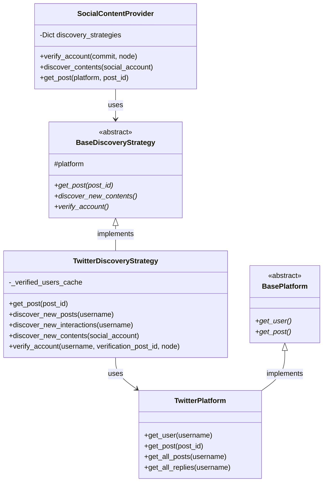

```mermaid
classDiagram
    class SocialContentProvider {
        -Dict discovery_strategies
        +verify_account(commit, node)
        +discover_contents(social_account)
        +get_post(platform, post_id)
    }
    
    class BaseDiscoveryStrategy {
        <<abstract>>
        #platform
        +get_post(post_id)*
        +discover_new_contents()*
        +verify_account()*
    }
    
    class TwitterDiscoveryStrategy {
        -_verified_users_cache
        +get_post(post_id)
        +discover_new_posts(username)
        +discover_new_interactions(username)
        +discover_new_contents(social_account)
        +verify_account(username, verification_post_id, node)
    }
    
    class BasePlatform {
        <<abstract>>
        +get_user()*
        +get_post()*
    }
    
    class TwitterPlatform {
        +get_user(username)
        +get_post(post_id)
        +get_all_posts(username)
        +get_all_replies(username)
    }
    
    SocialContentProvider --> BaseDiscoveryStrategy : uses
    BaseDiscoveryStrategy <|-- TwitterDiscoveryStrategy : implements
    
    TwitterDiscoveryStrategy --> TwitterPlatform : uses
    BasePlatform <|-- TwitterPlatform : implements
```