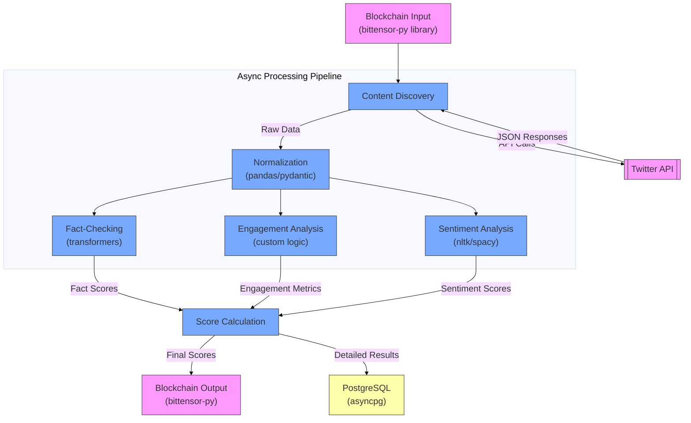

```mermaid
%%{init: {
  'theme': 'base',
  'themeVariables': {
    'fontSize': '20px',
    'nodeFontSize': '18px',
    'edgeLabelFontSize': '16px'
  },
  'viewBox': '0 0 2000 1500',
  'flowchart': { 'nodeSpacing': 200, 'rankSpacing': 60 }
}}%%

flowchart TD
    BCI["Blockchain Input
    (bittensor-py library)"] --> CD[Content Discovery]
    
    subgraph Pipeline[Async Processing Pipeline]
        CD -->|Raw Data| Norm["Normalization
        (pandas/pydantic)"]
        Norm --> FC["Fact-Checking
        (transformers)"]
        Norm --> EA["Engagement Analysis
        (custom logic)"]
        Norm --> SA["Sentiment Analysis
        (nltk/spacy)"]
    end

    FC -->|Fact Scores| SC["Score Calculation"]
    EA -->|Engagement Metrics| SC
    SA -->|Sentiment Scores| SC
    
    SC -->|Final Scores| BCO["Blockchain Output
    (bittensor-py)"]
    SC -->|Detailed Results| DB["PostgreSQL
    (asyncpg)"]
    
    CD -->|API Calls| TW[[Twitter API]]
    TW -->|JSON Responses| CD

    classDef external fill:#f9f,stroke:#333;
    classDef process fill:#7af,stroke:#333;
    classDef storage fill:#ffa,stroke:#333;
    class BCI,BCO,TW external;
    class CD,Norm,FC,EA,SA,SC process;
    class DB storage;
```