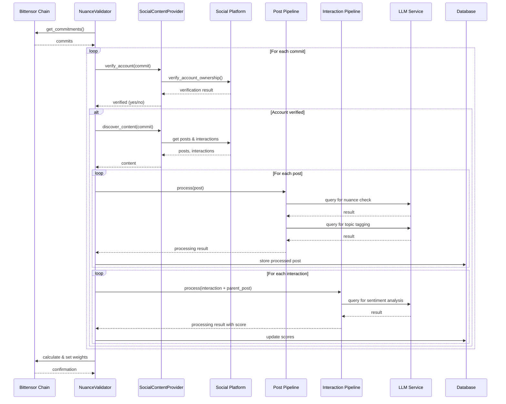

```mermaid
sequenceDiagram
    participant Chain as Bittensor Chain
    participant Validator as NuanceValidator
    participant SCP as SocialContentProvider
    participant Platform as Social Platform
    participant PP as Post Pipeline
    participant IP as Interaction Pipeline
    participant LLM as LLM Service
    participant DB as Database
    
    Validator->>Chain: get_commitments()
    Chain-->>Validator: commits
    
    loop For each commit
        Validator->>SCP: verify_account(commit)
        SCP->>Platform: verify_account_ownership()
        Platform-->>SCP: verification result
        SCP-->>Validator: verified (yes/no)
        
        alt Account verified
            Validator->>SCP: discover_content(commit)
            SCP->>Platform: get posts & interactions
            Platform-->>SCP: posts, interactions
            SCP-->>Validator: content
            
            loop For each post
                Validator->>PP: process(post)
                PP->>LLM: query for nuance check
                LLM-->>PP: result
                PP->>LLM: query for topic tagging
                LLM-->>PP: result
                PP-->>Validator: processing result
                Validator->>DB: store processed post
            end
            
            loop For each interaction
                Validator->>IP: process(interaction + parent_post)
                IP->>LLM: query for sentiment analysis
                LLM-->>IP: result
                IP-->>Validator: processing result with score
                Validator->>DB: update scores
            end
        end
    end
    
    Validator->>Chain: calculate & set weights
    Chain-->>Validator: confirmation
```