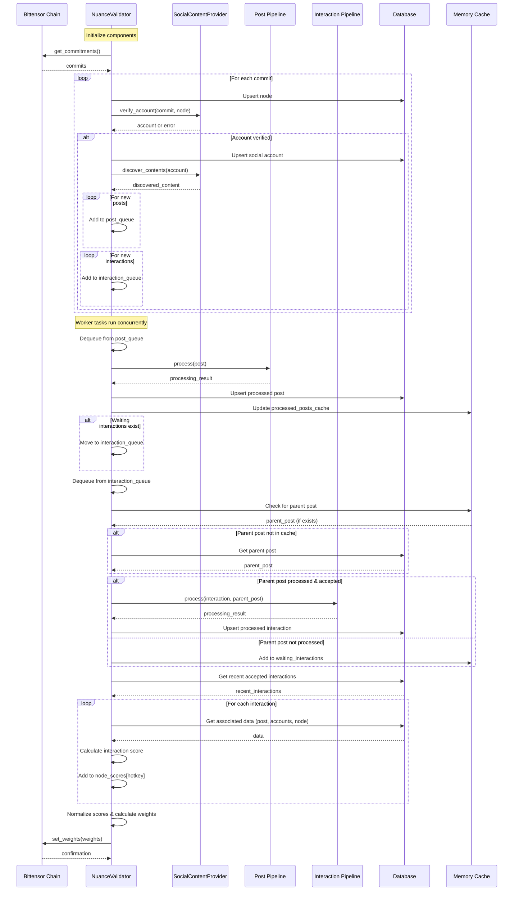

```mermaid
sequenceDiagram
    participant Chain as Bittensor Chain
    participant Validator as NuanceValidator
    participant SCP as SocialContentProvider
    participant PP as Post Pipeline
    participant IP as Interaction Pipeline
    participant DB as Database
    participant Cache as Memory Cache
    
    Note over Validator: Initialize components
    
    %% Content Discovery
    Validator->>Chain: get_commitments()
    Chain-->>Validator: commits
    
    loop For each commit
        Validator->>DB: Upsert node
        Validator->>SCP: verify_account(commit, node)
        SCP-->>Validator: account or error
        
        alt Account verified
            Validator->>DB: Upsert social account
            Validator->>SCP: discover_contents(account)
            SCP-->>Validator: discovered_content
            
            loop For new posts
                Validator->>Validator: Add to post_queue
            end
            
            loop For new interactions
                Validator->>Validator: Add to interaction_queue
            end
        end
    end
    
    Note over Validator: Worker tasks run concurrently
    
    %% Post Processing
    Validator->>Validator: Dequeue from post_queue
    Validator->>PP: process(post)
    PP-->>Validator: processing_result
    Validator->>DB: Upsert processed post
    Validator->>Cache: Update processed_posts_cache
    
    alt Waiting interactions exist
        Validator->>Validator: Move to interaction_queue
    end
    
    %% Interaction Processing
    Validator->>Validator: Dequeue from interaction_queue
    Validator->>Cache: Check for parent post
    Cache-->>Validator: parent_post (if exists)
    
    alt Parent post not in cache
        Validator->>DB: Get parent post
        DB-->>Validator: parent_post
    end
    
    alt Parent post processed & accepted
        Validator->>IP: process(interaction, parent_post)
        IP-->>Validator: processing_result
        Validator->>DB: Upsert processed interaction
    else Parent post not processed
        Validator->>Cache: Add to waiting_interactions
    end
    
    %% Score Aggregation
    Validator->>DB: Get recent accepted interactions
    DB-->>Validator: recent_interactions
    
    loop For each interaction
        Validator->>DB: Get associated data (post, accounts, node)
        DB-->>Validator: data
        Validator->>Validator: Calculate interaction score
        Validator->>Validator: Add to node_scores[hotkey]
    end
    
    Validator->>Validator: Normalize scores & calculate weights
    Validator->>Chain: set_weights(weights)
    Chain-->>Validator: confirmation
```