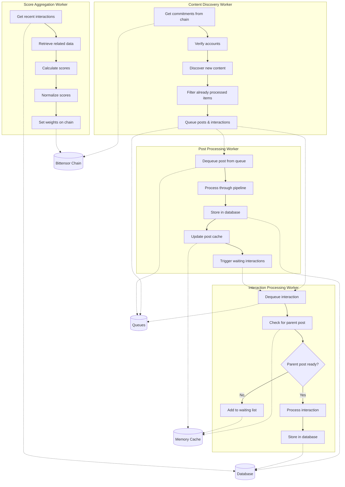

```mermaid
flowchart TB
    subgraph "Content Discovery Worker"
        direction TB
        cd1[Get commitments from chain]
        cd2[Verify accounts]
        cd3[Discover new content]
        cd4[Filter already processed items]
        cd5[Queue posts & interactions]
        
        cd1 --> cd2
        cd2 --> cd3
        cd3 --> cd4
        cd4 --> cd5
    end
    
    subgraph "Post Processing Worker"
        direction TB
        pp1[Dequeue post from queue]
        pp2[Process through pipeline]
        pp3[Store in database]
        pp4[Update post cache]
        pp5[Trigger waiting interactions]
        
        pp1 --> pp2
        pp2 --> pp3
        pp3 --> pp4
        pp4 --> pp5
    end
    
    subgraph "Interaction Processing Worker"
        direction TB
        ip1[Dequeue interaction]
        ip2[Check for parent post]
        ip3{Parent post ready?}
        ip4[Process interaction]
        ip5[Store in database]
        ip6[Add to waiting list]
        
        ip1 --> ip2
        ip2 --> ip3
        ip3 -->|Yes| ip4
        ip4 --> ip5
        ip3 -->|No| ip6
    end
    
    subgraph "Score Aggregation Worker"
        direction TB
        sa1[Get recent interactions]
        sa2[Retrieve related data]
        sa3[Calculate scores]
        sa4[Normalize scores]
        sa5[Set weights on chain]
        
        sa1 --> sa2
        sa2 --> sa3
        sa3 --> sa4
        sa4 --> sa5
    end
    
    %% Shared resources
    SharedDB[(Database)]
    SharedCache[(Memory Cache)]
    SharedQueues[(Queues)]
    BittensorChain[(Bittensor Chain)]
    
    %% Resource connections
    cd1 -.-> BittensorChain
    cd5 -.-> SharedQueues
    pp1 -.-> SharedQueues
    pp3 -.-> SharedDB
    pp4 -.-> SharedCache
    ip1 -.-> SharedQueues
    ip2 -.-> SharedCache
    ip5 -.-> SharedDB
    ip6 -.-> SharedCache
    sa1 -.-> SharedDB
    sa5 -.-> BittensorChain
    
    %% Worker connections
    cd5 -.-> pp1
    cd5 -.-> ip1
    pp5 -.-> ip1
```